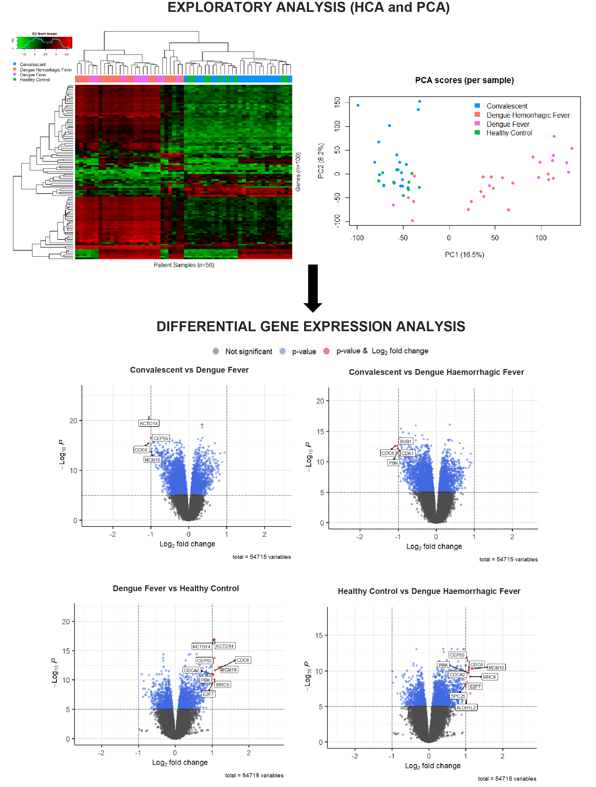

# dengue-transcriptomics
This repository contains the R code used for the transcriptomic analysis of blood from patients infected with acute Dengue virus (DENV) and during convalescence (which formed part of my MSc Bioinformatics coursework). The aim of this study was to gain insights into the molecular mechanisms underlying host response to DENV infection, through:
1. Visualising the relationships between gene expression profiles of each patient population; and
2. Identifying the genes that show the most significant difference in expression between these populations.

## Data availability
The data is publicly available and can be accessed using the Gene Expression Omnibus (GEO) browser (GEO accession number: [GDS5093](https://www.ncbi.nlm.nih.gov/sites/GDSbrowser?acc=GDS5093)). It consists of a total of 56 patients (18 with dengue fever, 10 with dengue haemorrhagic fever, 19 convalescent and 9 healthy controls).

## Analysis workflow
Data import:
- Data was imported directly into R, converted into an ExpressionSet object and explored using Bioconductor's `GEOquery` (v2.58.0) package. The raw expression data was extracted for downstream analysis.

Data pre-processing:
- To ensure easier interpretation of results and removal of replicate expression measurements, the average expression of multiple probes corresponding to the same gene was taken from the raw expression dataset, using the avereps() function from the `LIMMA` (v3.46.0) package.

Hierarchical clustering analysis (HCA):
- HCA was performed using the top 100 genes with the highest variance. NB: selecting only the top 100 genes, rather than selecting all 31,654 genes (or even the top 1,000 genes), avoids a very dense dendrogram that is difficult to interpret.
- Euclidean distance and complete linkage were chosen as the choice of distance and linkage algorithms, respectively.
- Results were visualised using the heatmap.2() function from the `gplots` (v3.1.1) package, and samples were further labelled by colour according to their disease status.

Principal component analysis (PCA):
- PCA was performed on the full transposed dataset (so that samples are rows, and variables (genes) are columns) using the prcomp() function (native to R), and visualised using the `ggplot2` (v3.3.2) package.
- To ensure variables were standardised prior to PCA, the scaling argument was set to true and the centering argument was set to true by default. Default settings were used for all other arguments.

Differential gene expression analysis:
- Analysis was performed using the `LIMMA` (v3.46.0) package. As the dataset is from a single-channel experimental design and contains several groups, an appropriate design matrix was created to fit the linear model and pair-wise comparisons between all disease state groups were made.
- Empirical Bayes smoothing was then applied to the standard errors to give the final statistical results of each hypothesis test.
- The results were visualised as volcano plots showing significant differentially expressed genes, using the `EnhancedVolcano` (v1.8.0) package.

## Results summary

